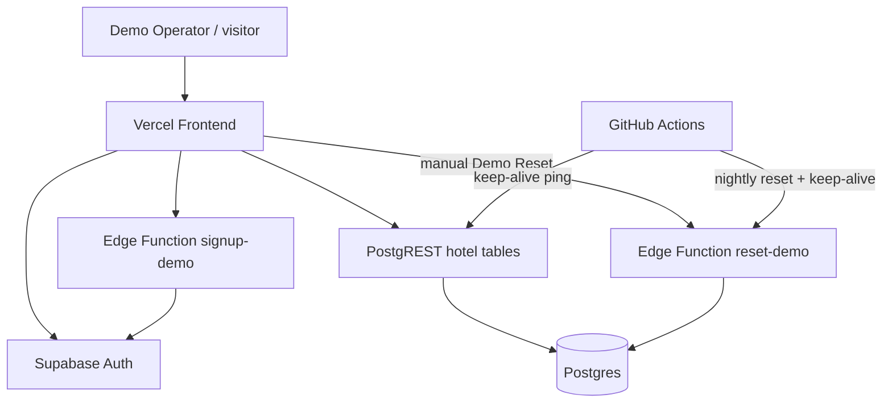

# Kiến trúc hệ thống

The Wild Oasis Admin là frontend **Vite + React** chạy trên **Vercel**, dùng **Supabase** (Auth, Postgres, Edge Functions) làm backend. Môi trường production là một **Demo Sandbox** công khai: mọi Demo Operator thao tác trên **một** bộ hotel data dùng chung.

Thuật ngữ: xem [CONTEXT.md](../CONTEXT.md). Quyết định nền: [ADR-0001](adr/0001-demo-sandbox-shared-data.md), [ADR-0002](adr/0002-postgres-write-guards.md), [ADR-0003](adr/0003-external-scheduler.md).

## Sơ đồ tổng thể



## Thành phần chính

| Thành phần | Vai trò |
|------------|---------|
| **Vercel** | Host SPA; env `VITE_*` được bake lúc build |
| **Supabase Auth** | Đăng ký / đăng nhập Demo Operator; tài khoản **không** bị xóa khi Demo Reset |
| **PostgREST** | CRUD `cabins`, `guests`, `bookings`, `settings` từ browser (anon/authenticated + RLS) |
| **Postgres triggers** | Chặn write trong Maintenance Window; đếm write quota (60/giờ/user) |
| **`demo_meta`** | Cờ `maintenance_until`, `last_reset_at`, `next_scheduled_reset_at` |
| **Edge `signup-demo`** | (Khi có Turnstile) tạo user sau khi verify captcha |
| **Edge `reset-demo`** | Demo Reset: JWT (thủ công) hoặc `x-reset-cron-secret` (lịch) |
| **RPC `run_demo_reset`** | Truncate + seed hotel data trong DB |
| **GitHub Actions** | Nightly Demo Reset; keep-alive Free tier |

## Luồng Sign up

1. Trang `/login` → mode Sign up (không còn tạo user từ `/users`).
2. Nếu có `VITE_TURNSTILE_SITE_KEY` → gọi `signup-demo` → `auth.admin.createUser` → client `signInWithPassword`.
3. Nếu không có Turnstile (local) → `supabase.auth.signUp` trực tiếp (dev bypass).

## Luồng Demo Reset

| Loại | Ai gọi | Maintenance Window | Cooldown |
|------|--------|--------------------|----------|
| Scheduled | Actions `nightly-demo-reset.yml` lúc 00:00 UTC | ~30 phút | — |
| Manual | Nút Settings → Edge Function (JWT) | ~5 phút | 1 lần / user / 24h |

Reset **có**: `cabins`, `guests`, `bookings`, `settings` (+ seed).  
Reset **không**: Auth users, avatars.

Trong Maintenance Window: UI hiện màn bảo trì; trigger DB từ chối INSERT/UPDATE/DELETE.

## Cấu trúc thư mục liên quan

```
src/features/demo/     # Banner, maintenance UI, Turnstile, reset panel
src/services/apiDemo.js
supabase/functions/    # reset-demo, signup-demo
supabase/migrations/   # run_demo_reset SQL
.github/workflows/     # keep-alive, nightly reset
vercel.json            # SPA rewrite → index.html
```
