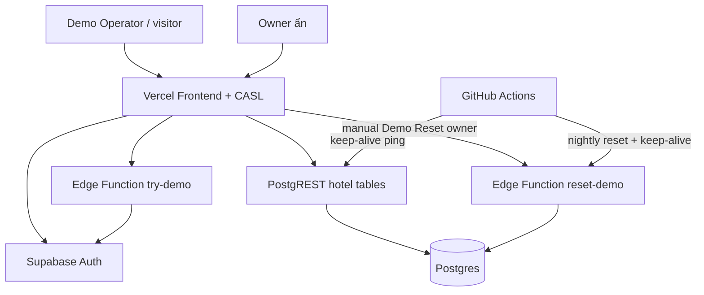

# Kiến trúc hệ thống

The Wild Oasis Admin là frontend **Vite + React** chạy trên **Vercel**, dùng **Supabase** (Auth, Postgres, Edge Functions) làm backend. Môi trường production là một **Demo Sandbox** công khai: mọi Demo Operator thao tác trên **một** bộ hotel data dùng chung qua session demo dùng chung.

Thuật ngữ: xem [CONTEXT.md](../CONTEXT.md). Quyết định nền: [ADR-0001](adr/0001-demo-sandbox-shared-data.md), [ADR-0002](adr/0002-postgres-write-guards.md), [ADR-0003](adr/0003-external-scheduler.md).

## Sơ đồ tổng thể


```mermaid
flowchart TB
  Visitor[Demo Operator / visitor]
  Owner[Owner ẩn]
  Vercel[Vercel Frontend + CASL]
  Auth[Supabase Auth]
  Rest[PostgREST hotel tables]
  PG[(Postgres)]
  GHA[GitHub Actions]
  ResetFn[Edge Function reset-demo]
  TryDemoFn[Edge Function try-demo]

  Visitor --> Vercel
  Owner --> Vercel
  Vercel --> Auth
  Vercel --> Rest
  Vercel --> TryDemoFn
  Vercel -->|manual Demo Reset owner| ResetFn
  Rest --> PG
  TryDemoFn --> Auth
  ResetFn --> PG
  GHA -->|nightly reset + keep-alive| ResetFn
  GHA -->|keep-alive ping| Rest
```

## Thành phần chính

| Thành phần | Vai trò |
|------------|---------|
| **Vercel** | Host SPA; env `VITE_*` được bake lúc build |
| **Supabase Auth** | Session demo dùng chung (`app_metadata.role=demo`) hoặc owner (`role=owner`); Auth **không** bị xóa khi Demo Reset |
| **CASL** | `defineAbilityFor(user)` từ `app_metadata.role` — UI only; demo: hotel CRUD; owner: thêm Account + manual Demo Reset |
| **PostgREST** | CRUD `cabins`, `guests`, `bookings`, `settings` từ browser (anon/authenticated + RLS) |
| **Postgres triggers** | Chặn write trong Maintenance Window; đếm write quota (60/giờ/user) |
| **`demo_meta`** | Cờ `maintenance_until`, `last_reset_at`, `next_scheduled_reset_at` |
| **Edge `try-demo`** | Đảm bảo user demo dùng chung + trả session tokens (`setSession` trên client) |
| **Edge `reset-demo`** | Demo Reset: JWT (thủ công, owner) hoặc `x-reset-cron-secret` (lịch) |
| **RPC `run_demo_reset`** | Truncate + seed hotel data trong DB |
| **GitHub Actions** | Nightly Demo Reset (chỉ gọi `reset-demo`); keep-alive Free tier |

## Luồng Try Demo

1. Trang `/login` → nút **Try Demo** (không có Sign up công khai).
2. Client gọi Edge `try-demo` (Turnstile tuỳ chọn nếu có secret phía server).
3. Function: user theo `DEMO_USER_EMAIL` / `DEMO_USER_PASSWORD` (Edge secrets); tạo nếu thiếu với `app_metadata.role=demo`.
4. Trả tokens → `supabase.auth.setSession` → SPA bọc **AbilityProvider** (CASL).

## Luồng đăng nhập account

1. Form email/mật khẩu trên `/login` (cùng trang với **Try Demo**; không Sign up công khai).
2. `signInWithPassword`. User `app_metadata.role=owner` (tạo thủ công trong Dashboard) được CASL full; role khác / thiếu → abilities `demo`.

## Luồng Demo Reset

| Loại | Ai gọi | Maintenance Window | Cooldown |
|------|--------|--------------------|----------|
| Scheduled | Actions `nightly-demo-reset.yml` lúc 00:00 UTC | ~30 phút | — |
| Manual | Nút Settings (CASL owner) → Edge Function (JWT) | ~5 phút | 1 lần / user / 24h |

Reset **có**: `cabins`, `guests`, `bookings`, `settings` (+ seed).  
Reset **không**: Auth users, avatars.

Trong Maintenance Window: UI hiện màn bảo trì; trigger DB từ chối INSERT/UPDATE/DELETE.

## Cấu trúc thư mục liên quan

```
src/features/casl/     # defineAbilityFor, AbilityProvider
src/features/demo/     # Banner, maintenance UI, Turnstile, reset panel
src/services/apiAuth.js
supabase/functions/    # try-demo, reset-demo
supabase/migrations/   # run_demo_reset SQL
.github/workflows/     # keep-alive, nightly reset
vercel.json            # SPA rewrite → index.html
```
