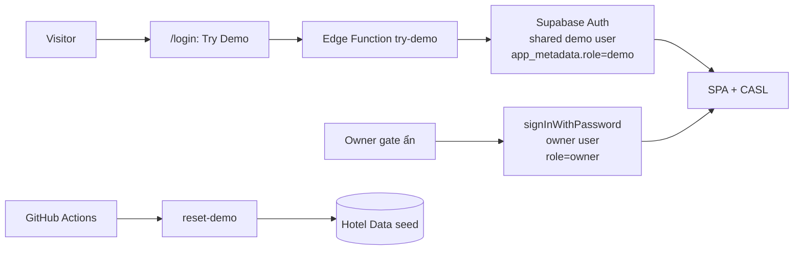

# Try Demo + CASL Auth Design

**Date:** 2026-09-24  
**Status:** approved for planning  
**Project:** the-wild-oasis-admin

## Problem

Public Sign up / email-password login is friction for a portfolio Demo Sandbox. Visitors should enter with one click. Authorization differences (demo vs owner) should be explicit in the UI via CASL. Nightly Demo Reset stays.

## Goals

- Replace public login/signup UX with a **Try Demo** button.
- Mint a session for a **shared demo Auth user** via Edge Function `try-demo` (no demo password in the frontend bundle).
- Use **CASL** with roles `demo` | `owner` from `app_metadata.role`.
- **Owner** access only via a hidden login gate (not advertised).
- Keep shared Hotel Data, Write Quota, Maintenance Window, and **nightly Demo Reset**.

## Non-goals

- Multi-tenant / per-visitor hotel data
- Enforcing CASL in Postgres (UI only; DB stays RLS + triggers)
- Deleting Auth users on Demo Reset
- Public “Try as Owner”
- Replacing Write Quota `user_id` with IP-based limits
- Rebuilding the hotel domain features

## Decisions (locked)

| Topic | Choice |
|-------|--------|
| Identity for visitors | Shared demo Auth account |
| Role model | CASL + `demo` / `owner` |
| How visitors get `demo` | Edge Function `try-demo` → session tokens |
| How owner signs in | Hidden gate on `/login` (Logo ×5 or `?owner=1`) + `signInWithPassword` |
| Ability split | `demo`: hotel CRUD; no Account update; no manual Demo Reset. `owner`: full |
| Nightly reset | Keep existing GitHub Action → `reset-demo` |

## Architecture

### Components

| Component | Role |
|-----------|------|
| `/login` | Try Demo CTA; optional hidden owner form; no public Sign up |
| Edge `try-demo` | Ensure shared demo user + return session tokens |
| `apiAuth.tryDemo` | Invoke function, `supabase.auth.setSession` |
| CASL AbilityProvider | `defineAbilityFor(user)` from `app_metadata.role` |
| Existing `reset-demo` + GHA | Unchanged nightly / manual (manual UI gated to owner) |
| RLS + Write Quota | Unchanged; shared demo user shares one quota bucket |

### Removed from public UX

- Sign up form / mode toggle on Login
- Turnstile on public Sign up path
- Reliance on `signup-demo` for visitor entry (function may remain unused or be removed in a follow-up)

## CASL ability matrix

Roles come from `user.app_metadata.role` (`"demo"` | `"owner"`). Missing/unknown role → treat as `demo` (deny privileged actions).

| Ability | Subject | `demo` | `owner` |
|---------|---------|--------|---------|
| `manage` | `all` | — | yes |
| `read` / `create` / `update` / `delete` | `Cabin`, `Booking`, `Settings`, `HotelGuest` | yes | yes |
| `update` | `Account` | no | yes |
| `reset` | `DemoSandbox` | no | yes |

### UI enforcement

- Wrap Account nav button and `/account` content with `Can update Account`.
- Redirect `demo` away from `/account` → `/dashboard`.
- Wrap `DemoResetPanel` with `Can reset DemoSandbox`.
- Logout remains available for both roles.

CASL is **not** a security boundary against a crafted client; Postgres RLS and write triggers remain authoritative for data mutation.

## Edge Function `try-demo`

**Invoke:** `POST`, public (anon key), CORS aligned with existing functions.

**Secrets (Edge only, never `VITE_*`):**

- `SUPABASE_URL`, `SUPABASE_SERVICE_ROLE_KEY` (platform)
- `DEMO_USER_EMAIL`, `DEMO_USER_PASSWORD` (shared demo account)

**Algorithm:**

1. Reject non-POST.
2. Optional light abuse control: if `TURNSTILE_SECRET_KEY` is set, require and verify Turnstile; otherwise skip (v1 default = skip for simplicity).
3. Admin client: look up user by `DEMO_USER_EMAIL`; if missing, `createUser` with email confirmed + `app_metadata: { role: "demo" }` and `user_metadata` display name (e.g. “Demo Operator”).
4. If user exists, ensure `app_metadata.role === "demo"` (update if needed).
5. Obtain a session for that user server-side (password sign-in with service path or admin-equivalent that yields `access_token` + `refresh_token`).
6. Return `{ access_token, refresh_token }` (and expiry fields if available).
7. On failure, return JSON error with appropriate status; never leak service role or demo password.

**Client:**

1. `tryDemo()` → invoke `try-demo`.
2. `supabase.auth.setSession({ access_token, refresh_token })`.
3. Navigate to `/dashboard`.
4. Toast + retry on error.

## Owner gate

- Default `/login` UI: Logo, DemoStatusBanner, heading, **Try Demo**, short copy that this is a shared sandbox with nightly reset.
- Reveal email/password form when: Logo clicked 5 times **or** URL has `?owner=1` (no public nav link).
- Form uses existing `signInWithPassword`; owner user must already exist in Supabase with `app_metadata.role = "owner"`.
- No public Sign up.

## One-time ops setup

1. Create (or let `try-demo` create) shared demo user; set Edge secrets `DEMO_USER_EMAIL` / `DEMO_USER_PASSWORD`.
2. Create owner user manually; set `app_metadata.role = "owner"`; remember password offline.
3. Deploy `try-demo`; keep `reset-demo` + nightly workflow as today.
4. Update docs: README, CONTEXT (Demo Operator = shared demo session), architecture, configuration, deploy checklist.

## Frontend file impact (expected)

| Area | Change |
|------|--------|
| `package.json` | Add `@casl/ability`, `@casl/react` |
| `src/pages/Login.jsx` | Try Demo + hidden owner form |
| `src/services/apiAuth.js` | `tryDemo()`; keep login/logout/getUser; drop public signup from UX path |
| `src/features/authentication/*` | Hooks for tryDemo; Account forms only when allowed |
| `src/features/casl/*` (new) | `defineAbilityFor`, AbilityProvider, helpers |
| `src/ui/HeaderMenu.jsx` | Gate Account with CASL |
| `src/App.jsx` / ProtectedRoute | Ability provider under authenticated tree; account route guard |
| `src/features/demo/DemoResetPanel.jsx` | CASL gate |
| `supabase/functions/try-demo/` | New Edge Function |
| Docs under `docs/` + `CONTEXT.md` / `README.md` | Auth flow rewrite |

## Error & maintenance behavior

- Try Demo failure → toast + retry; stay on `/login`.
- During Maintenance Window → existing banner / MaintenanceScreen; session may still be established; writes rejected by DB as today.
- Shared demo user means Write Quota is shared across all visitors (accepted consequence of shared identity).

## Acceptance checks

1. Visitor clicks Try Demo → lands on dashboard authenticated as `demo`.
2. `demo` can CRUD cabins/bookings/settings; cannot open Account; cannot see/use manual Demo Reset.
3. Owner gate login → `owner`; sees Account + Demo Reset panel; manual reset still works.
4. Nightly scheduled reset still runs via existing Action + `reset-demo`.
5. No demo password or service role in frontend env / bundle.

## Spec self-review notes

- No TBD placeholders left for v1 behavior.
- Turnstile on `try-demo` is optional and off by default (explicit).
- `signup-demo` deprecation of UX is in scope; hard deletion of the function is optional follow-up.
- Quota shared under one demo `user_id` is an accepted consequence, not a bug.
